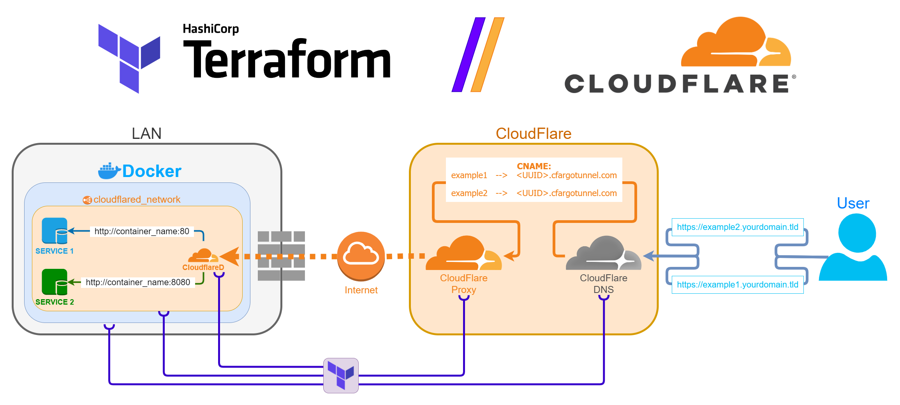

## General outline of the project

1. Set up a Cloudflare tunnel and configure it remotely.
    This can be done locally with a config.yaml file but we are doing it through Cloudflare itself. Every time the CloudflareD container starts it will pull down the relevant configuration.

2. Set up the proper DNS records for our tunnel.
    Both the tunnel's **ingress rules** and the **DNS records** will be defined recusively, based on the predefined varaibles.

3. Set up Cloudflared container.
    Upon starting, its given a token that was defined in Step 1. It connects to Cloudflare and pulls the config.

The whole setup should take no more than a minute.

## 💡 Commands used in this project
```bash
# Initializing/upgrading the project
terraform init -upgrade

# Imports the docker nextwork "cloudflared_network" for cloudlared & other containers if it exists.
# On first run, this shouldn't be a problem.
# Here is a one-liner, you need to supply the network name.
docker network inspect cloudflared_network -f "{{json .Id }}" | terraform import docker_network.cloudflared_network _

terraform apply -auto-approve

# Should destroy everything but the Docker network because it's probably used by other containers.
terraform apply -destroy -auto-approve
```

## 📝 Variables used in this project
Rename the `variables.auto.tfvars.example` to `variables.auto.tfvars` and fill it in.
```py
# Credentials
  # Either
    CF_email = "username@email.tld"
    # Use global Global API Key from https://dash.cloudflare.com/profile/api-tokens
    CF_apikey = ""

  # Or
    # Generate an API token from https://dash.cloudflare.com/profile/api-tokens
    # Must have enabled:
    #   Zones.DNS
    #   Account.Cloudflare Tunnel
    #   Account.Account Settings
    CF_apitoken = ""

# Custom tunnel name.
  CF_tunnel_name = "some-cool-name"

# Domain to manage.
  DOMAIN = "yourdomain.tld"

# Map of services and subdomains. The service url is from the docker network.
  SUBDOMAINS = [
    {
      "subdomain":"example1",
      "service":"http://container_name:80"
    },
    {
      "subdomain":"example2",
      "service":"http://container_name:8080"
    }
  ]
```

## 📖 Relevant Documentation

### 🌟 Terraform Docker Provider
* [Documentation](https://registry.terraform.io/providers/kreuzwerker/docker/latest/docs/resources/container)

### 🌟 Terraform Cloudflare Provider
* [Tunnel Definition](https://registry.terraform.io/providers/cloudflare/cloudflare/latest/docs/resources/tunnel)
* [Tunnel Configuration](https://registry.terraform.io/providers/cloudflare/cloudflare/latest/docs/resources/tunnel_config)
* [Domain Data Source](https://registry.terraform.io/providers/cloudflare/cloudflare/latest/docs/data-sources/zone)
* [Domain DNS Records](https://registry.terraform.io/providers/cloudflare/cloudflare/latest/docs/resources/record)

### 🌟 Cloudflare Docs
* [API Keys and Tokens](https://developers.cloudflare.com/fundamentals/api/get-started/create-token/)
* [Tunnels Conifiguration](https://developers.cloudflare.com/cloudflare-one/connections/connect-apps/)


### 🌟 Misc useful resources

* [Dynamic blocks with foreach](https://developer.hashicorp.com/terraform/language/expressions/dynamic-blocks)
* [A lot of dynamic configuration from variables](https://blog.gruntwork.io/terraform-tips-tricks-loops-if-statements-and-gotchas-f739bbae55f9)